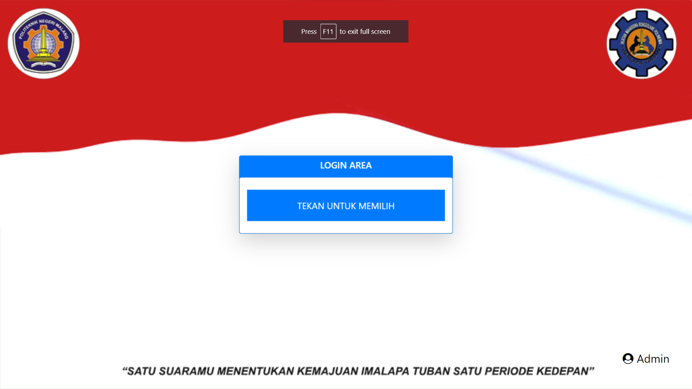
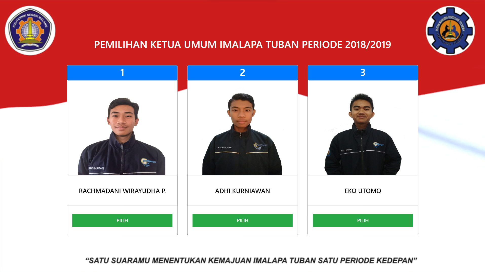
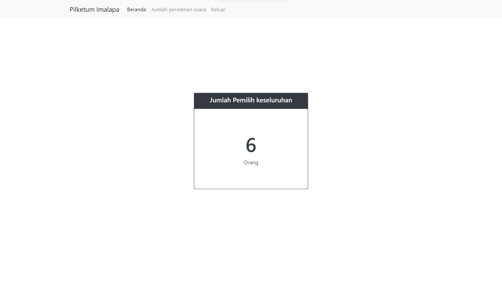
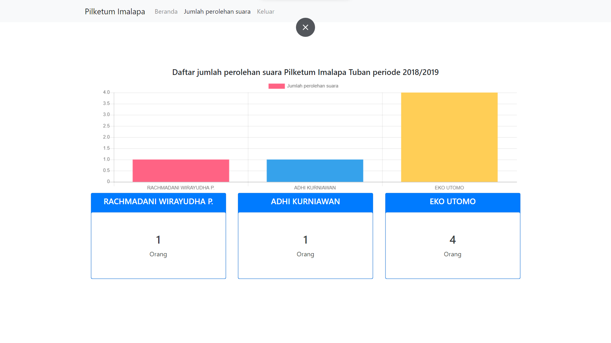

# Pilketum-imalapa

# Program pemilihan ketua umum Ikatan Mahasiswa Ronggolawe Polinema Tuban (IMALAPA TUBAN)

## How to use : 
1. Import database `pilketum_imalapa.sql`
2. Edit `#koneksi` pada folder `koneksi/koneksi.php` sesuai dengan lokasi pada masing2 project
> Untuk Foto dan Data Calon bersifat native/menambahkan sendiri, hehe :smile:

## Screenshot
1. Dashboard awal

2. Memilih pilihan/ketua

3. Pada template admin, dapat melihat jumlah pemilih keseluruhan

4. Melihat presentase sesuai jumlah pemilih
